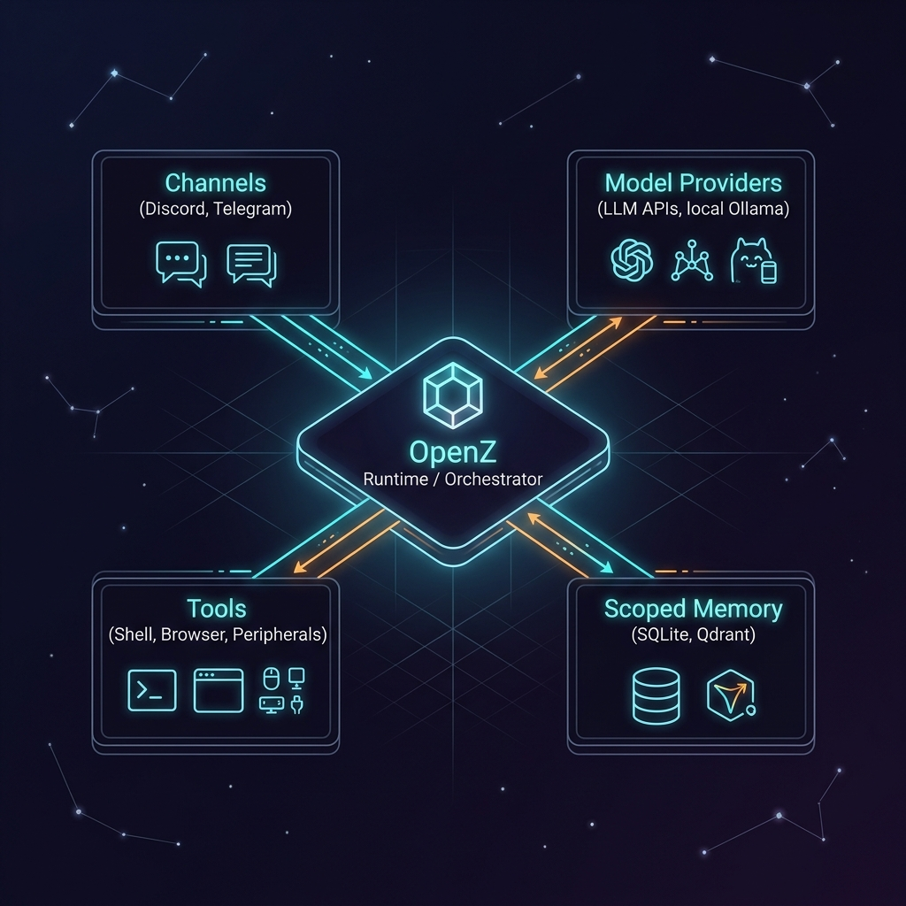

<p align="center">
  
</p>

<h1 align="center">⚡ OpenZ — Self-Improving Autonomous AI Agent Framework</h1>

<p align="center">
  <strong>A minimal, self-improving, cutting-edge AI Agent CLI & TUI framework. Forked from ZeroClaw.</strong>
</p>

<p align="center">
  <a href="https://github.com/aswin402/openz-agent/actions/workflows/ci.yml"></a>
  <a href="LICENSE-APACHE"></a>
  <a href="https://www.rust-lang.org"></a>
</p>

<p align="center">
  <a href="docs/book/src/introduction.md">Docs</a> ·
  <a href="docs/book/src/philosophy.md">Philosophy</a> ·
  <a href="docs/book/src/getting-started/quick-start.md">Quick Start</a> ·
  <a href="docs/book/src/architecture/overview.md">Architecture</a>
</p>

---

**OpenZ** is a lightweight, local-first agent runtime and multi-agent host compiled as a single native Rust binary. It connects LLM providers (Anthropic, OpenAI, Gemini, Ollama, Manifest, and ~30 others) to 30+ communication channels (Discord, Telegram, Slack, Mattermost, Nextcloud Talk, email, webhooks, and an interactive CLI/TUI) and gives them tools (sandboxed shell, browser automation, database memory, hardware boards, and custom MCP servers).

Forked from **ZeroClaw**, OpenZ introduces next-generation features including autonomous multi-agent task workflows, closed-loop skill creator self-improvement, pre-flight safety scanners, and cryptographic audit logs.

---

## ⚡ Key Features & Capabilities

### 🤖 Master-Worker Multi-Agent Orchestrator
OpenZ features a multi-phase, multi-agent task execution pipeline (`AgentzWorkflow`) that resolves user requests through specialized agent coordination:
* **Vision Preprocessing**: A specialized `vision-agent` intercepts image attachments and compiles rich Markdown description text.
* **Codebase Research**: A `research-agent` searches workspace files, files in git status, and external APIs to gather codebase context.
* **Planning & Evaluation Gate**: An `openz-planagent` constructs a technical specification, implementation plan, target files list, and acceptance checklist. The **Primary Lead Agent** evaluates and approves or rejects the plan with feedback, looping up to 3 times to achieve plan convergence.
* **Specialized Execution**: The plan is routed to either a specialized `coder` agent (restricted to editing target files) or a general `worker` agent (equipped with shell execution and web search).
* **Verification & Debugger**: A `reviewer` agent runs unit tests and linters. If errors are detected, it invokes a debugger loop (up to 3 times) to auto-apply fixes and re-verify.
* **Documentation & Summary**: A `docs-agent` generates and updates documents based on the changes, and compiles a final technical summary.

### 🧠 Closed-Loop Skill Generation & Self-Evolution
* **Skill Creator**: Successful multi-step tool call sequences are captured and transformed into reusable playbooks (`SKILL.toml` and `SKILL.md`) in `~/.zeroclaw/workspace/skills/<slug>/`. Prompt embeddings are matched via cosine similarity to avoid duplication.
* **Skill Improver**: Optimizes existing skill documents atomically after successful usage. It updates frontmatter, preserves an audit trail of timestamps and improvement reasons in comments, and enforces a cooldown to prevent run-away optimization.

### 🔒 Enterprise-Grade Security & Audit Trails
* **Cryptographic Log Verification**: State events in `runtime-trace.jsonl` are cryptographically linked using SHA-256 Merkle hash chains and signed via HMAC-SHA256 with a local key (`.audit_key` protected by `0600` permissions). Integrity is verifiable using the `openz logs --verify` CLI command.
* **Pre-flight Guardrail Scanner**: The `prompt_guard.rs` engine scans incoming prompts for jailbreak attempts, role confusion (e.g., "DAN" mode), system prompt disregard, secret extraction, and shell injection.
* **WASM Dual-Metering**: Custom WASM plugins run sandboxed under parallel safety constraints: wall-clock execution timeout limits and CPU instruction count limits (`fuel_limit`).
* **Remote execution (SSH)**: Run command execution tools on remote staging servers via SSH to completely isolate local developer environments from untrusted code runs.

---

## 📊 Operational Profile & System Requirements

OpenZ is designed to run efficiently on everything from constrained edge devices to high-performance workstations.

| Metric | Specification | Notes |
|:---|:---|:---|
| **RAM Footprint** | <ul><li>**Idle Daemon**: ~15–25 MB</li><li>**Standard Run**: ~64–128 MB</li><li>**Peak Parallel Execution**: ~256 MB</li></ul> | Low memory consumption via Rust's zero-cost abstractions. Memory scales with active local MCPs. |
| **ROM (Disk Space)** | <ul><li>**Minimal Kernel**: ~6.6 MB</li><li>**Standard Release**: ~12–18 MB</li><li>**Total Workspace footprint**: ~50 MB</li></ul> | Standard workspace footprint includes the local SQLite DB, session stores, schemas, and generated skills. |
| **Processor Overhead** | <ul><li>**Architecture**: x86_64, ARM64 (Apple Silicon, Raspberry Pi)</li><li>**CPU Utilization**: Minimal (<1% idle)</li></ul> | Driven by an asynchronous Tokio event loop. CPU usage peaks only during local reasoning/regex scanning. |
| **Runtime Environment** | <ul><li>**Native Binary**: Compiled Rust (No VM, No GC)</li><li>**Plugin Engine**: Extism WASM VM</li></ul> | Zero-runtime dependency design makes it fully portable. WASM plugins are dual-metered. |
| **Coldstart Latency** | <ul><li>**Daemon Boot**: < 15 ms</li><li>**Subagent Spawn**: < 5 ms</li><li>**Config Hot-Reload**: < 2 ms</li></ul> | Near-instant startup speeds, making it ideal for event-driven functions and CLI invocations. |

---

## 📐 System Architecture

<p align="center">
  
</p>

OpenZ uses a decoupled, event-driven microkernel design. The central **OpenZ Runtime / Orchestrator** manages active multi-agent event loops (`AgentzWorkflow`) and routes tasks dynamically through the following modular subsystems:
* **Channels**: Unified inbound/outbound communication surface supporting Discord, Telegram, and 30+ other messaging networks.
* **Model Providers**: Pluggable LLM reasoning backends including local Ollama instances, major API providers, and open-source routers.
* **Scoped Memory**: Secure, agent-isolated database and vector stores (SQLite, Postgres, Qdrant).
* **Tools**: Extensible action library including local sandboxed shells, remote SSH nodes, browser automation, and hardware peripherals.

---

## 🛠️ MCPs & Extended Tooling

### Model Context Protocol (MCP)
OpenZ features native client implementation for the standard Model Context Protocol:
* Supported out-of-the-box servers: `github`, `gitlab`, `opencode`, `exa`, and local databases.
* Credentials and API tokens are dynamically isolated and loaded per-agent from `mcp.d/<agent_alias>.toml` or the central configuration.

### Supported Tool Interfaces
1. **Shell Execution**: Local subprocess running inside OS sandboxes (`Landlock` & `Bubblewrap` on Linux, `Seatbelt` on macOS).
2. **SSH Remote Shell**: Execution on remote staging servers.
3. **Browser Automation**: Reading page markdown, link parsing, and rendering/screenshot captures.
4. **Filesystem Sandbox**: Strict directory-jail reading/writing scoped to `/workspace/`.
5. **Vector Memory**: Semantic database search, vector inserts, and markdown knowledge base query.
6. **Hardware Peripherals**: Low-level communication via GPIO, I2C, SPI, and USB serial interfaces.

---

## ⚙️ Installation & Usage

### Quick Install
```bash
curl -fsSL https://raw.githubusercontent.com/aswin402/openz-agent/master/install.sh | bash
```

### Quick Start Commands
```bash
openz onboard                  # Run the interactive configuration wizard
openz agent -a assistant       # Launch the interactive chat agent TUI
openz logs --verify            # Verify cryptographic audit log integrity
openz hands list               # List available task blueprints
```

---

## 🤝 Contributing & License

For development workflows, guidelines, and single source of truth policies, please refer to [AGENTS.md](AGENTS.md) and [CONTRIBUTING.md](CONTRIBUTING.md).

* **License**: Dual-licensed under MIT OR Apache-2.0.
* **Upstream**: OpenZ is a downstream fork of ZeroClaw. Trademark names and respective parent logos remain property of their original creators.
