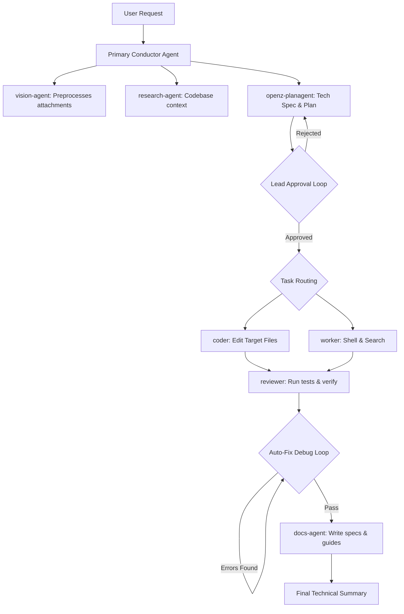

# ⚡ OpenZ — Subagents & Tooling Directory (TOOLS.md)

This document serves as the single source of truth for the subagent orchestration architecture, native Rust tools, and MCP (Model Context Protocol) configurations in **OpenZ**.

---

## 🤖 Multi-Agent Orchestration Architecture

OpenZ does not execute raw tools directly from the root orchestration level. Instead, it delegates all tasks to a team of specialized **Subagents** inside `AgentzWorkflow`. This multi-agent pipeline enforces strict task isolation, specialized tool access, and safety guardrails.

---

## 👥 Specialized Subagents List

| Subagent Name | Role / Focus | Allowed Toolset |
| :--- | :--- | :--- |
| **`vision-agent`** | Image analysis and Markdown description generation | `file_read`, `image_info` |
| **`research-agent`** | Codebase navigation, API exploration, and research reports | `glob_search`, `content_search`, `file_read`, `web_search_tool` |
| **`openz-planagent`** | Plan construction, file lists, and technical specification writing | `file_read` |
| **`coder`** | Implementing code edits on verified target files | `file_edit`, `file_write`, `file_read` |
| **`worker`** | Running shell commands, compilations, and web scrapes | `shell`, `web_search_tool`, `http_request` |
| **`reviewer`** | Code auditing, test executions, and verification gating | `shell`, `file_read` |
| **`docs-agent`** | Documenting structural changes and generating guides | `file_write`, `file_read` |

---

## ⚙️ Native Rust Tools Directory

These tools are compiled directly into the OpenZ Rust binary. They run with native speed and are automatically jail-scoped to the active `/workspace/` directory for security.

### 1. File & Directory Navigation
*   **`file_read`**: Reads target text/binary files within the workspace jail.
*   **`file_write`**: Creates or overwrites files securely.
*   **`file_edit`**: Contiguous search-and-replace tool for patching file blocks safely.
*   **`glob_search`**: High-performance glob matching for listing target file paths recursively.
*   **`content_search`**: Regex-based text/content search matching within workspace directories.

### 2. Browser & Visual Automation
*   **`browser`**: Controls a headless Chromium browser instance natively via CDP (Chrome DevTools Protocol) to click, scroll, type, and scrape.
*   **`cdp_browser`**: Low-level CDP command dispatcher for advanced browser interaction.
*   **`screenshot`**: Captures physical screen displays and saves monitor screens.
*   **`image_info`**: Extracts EXIF data, sizes, formats, and structural details from local images.

### 3. System & Diagnostics
*   **`shell`**: Runs shell commands securely in the workspace directory. Supports platform sandboxing (`Bubblewrap` on Linux, `Seatbelt` on macOS).
*   **`sys_info`**: Resolves CPU core loads, active PIDs, temperatures, memory pressure, and system metrics.

---

## 🔌 Configured Model Context Protocol (MCP) Servers

For integrations without specific native Rust tools, OpenZ bridges connection requests to standard MCP servers:

*   **`github`** (`npx -y @modelcontextprotocol/server-github`): Automated B2B issue triage, PR summaries, and repository actions.
*   **`sqlite`** (`uvx mcp-server-sqlite`): SQL query execution on embedded databases.
*   **`dns`** (`npx -y @cenemiljezweb/dns-mcp-server`): Core network lookup, routing, and nameserver lookups.
*   **`wikipedia`** (`uvx wikipedia-mcp`): Programmatic query lookup for encyclopedic articles.
*   **`sequential-thinking`**: Used to guide reasoning pipelines step-by-step.
